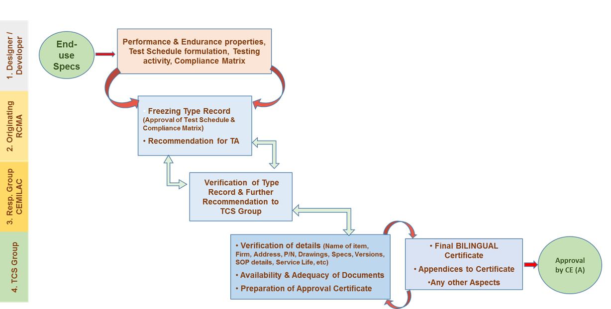
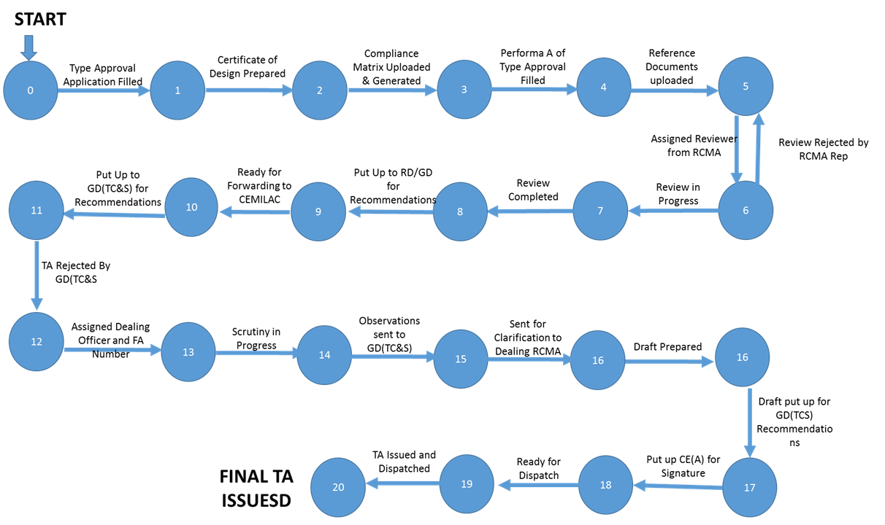
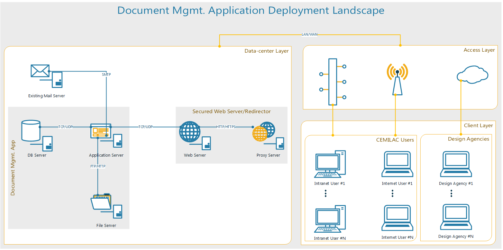
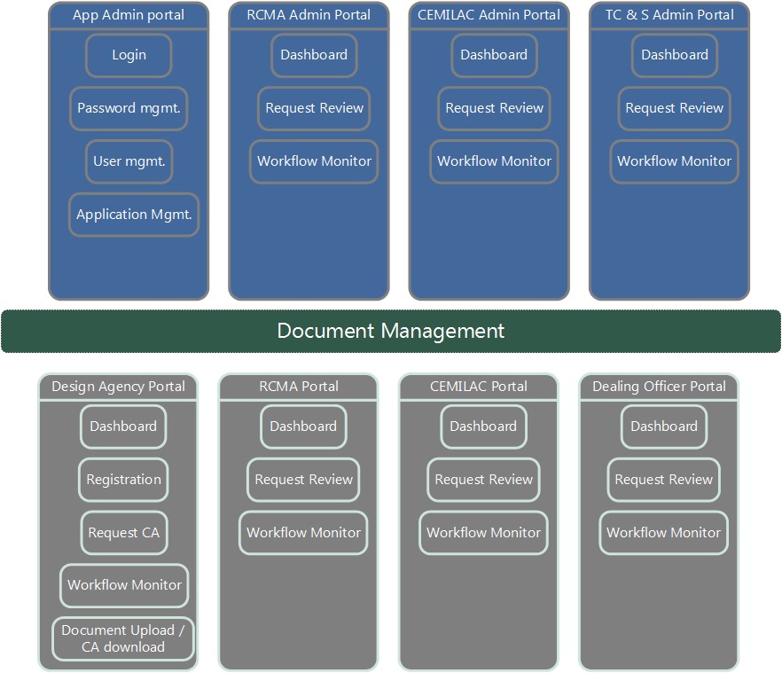

# CERTA <sup>GNS</sup> - Type Approval Automation

## Getting Started

Digitalize airworthiness certification to reduce the process time & increase the data integrity.

  * Less paper wastage
  * Type approval issuance will take less time 
  * All the relevant data will be available all the time to all the stake holders
  * Constant process for all the type approvals
  * Early intimation to the Design agencies about expiry of their TA
  * Transparency in the process of issuing type approval 
  * Less physical movement of files(Hard Copy)
  * 9Centralised storage of all the Type approvals and its documents  

## CEMILAC 

  Be an Internationally Recognised Airworthiness Certification Centre for State-of-the-Art Military Airborne Platforms and Stores
  
  dealing with the type approvals.

  * Issuing of Fresh Type Approvals
  * Amendment/Addendum to Type Approval
  * Renewal of Type Approval
  
  ### Process for Issuance of New Type Approval
  
  
  ### Quality Policy
  To be centre of excellence for airworthiness certification of all airborne stores for military application achieved through effective implementation of quality management system and its continual improvement with the commitment of everyone in the organization.
  
  

## Minimum Automation required on
 * Maintaining fine tuned database for issued type approvals 
 * Auto generated mail to the stake holders about 3 months before expiry and after expiry of type approval
 * Renewal, amendment and addendum of the type approvals
 
 ## Overall Process Flow
 
 
 ## Operational chart
 
 
 ### Application Landscape
 
 
 ### Approx. Modules
 
 
 ## Development Environment Setup
 ### Linux
  * OS: Ubuntu Desktop Edition
  * Front-end: Bootstrap 4
  * Back-end: MongoDB
  * Language: Python3
  * Web Framework: Django2.2
  * IDE: Visual Studio Code
 #### Installation Step by Step
  1. Update package,
  ````
  $sudo apt update
  $sudo apt upgrade
  ````
  2. Install Python3 & Pip
  ````
  $sudo apt install python3
  $sudo apt install python3-pip
  ````
  3. Check Python3 & pip Version
  ````
  $python3 -V
  $pip3 -V
  ````
  4. Install MongoDB & check status
  ````
  $sudo apt-get install mongodb
  $sudo service mongodb start
  $sudo service mongodb status
  ````
  open mongoDB terminal ```` $mongo ````
  5. Install virtual environment to isolate dependencies
  ````
  $pip3 install virtualenvwrapper
  ````
  configure default environment variables/setting for virtual environment
  ````
  $vim ~/.bashrc
  ````
  add below variables and save,
  ````
  export WORKON_HOME=$HOME/.virtualenvs
  export PROJECT_HOME=$HOME/Devel
  export VIRTUALENVWRAPPER_PYTHON=/usr/bin/python3
  export VIRTUALENVWRAPPER_VIRTUALENV=/usr/local/bin/virtualenv
  source ~/.local/bin/virtualenvwrapper.sh
  ````
  apply changes,
  ````
  $source ~/.bashrc
  ````
  6. Create virtual env for new development
  ````
  $mkproject <project_name>
  ````
  7. Install required dependencies using file
  ````
  $pip3 install -r requriements.txt
  ````
  8. Run project
  ````
  $python manage.py runserver
  ````
  
